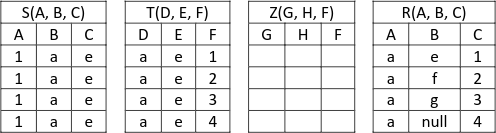
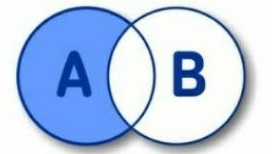

## Question 1:
Say if the following relational schema:
`< R(A,B,C,D), { AB -> C, C -> D, C -> A } >`

is in 3NF or not, provide a lossless 3NF decompression.

No, because AB and D are not contained in any key.

- `R1(A, B, C), { AB -> C, C -> A }`
- `R2(C, D), { C -> D }`

## Question 2:
Two sets of functional dependencies F<sub>1</sub> and F<sub>2</sub> over a schema S are equivalent if:

- [ ] If after applying the transitive closure to both sets, we obtain the same set of functional dependencies.
- [ ] If they are exactly the same set of functional dependencies.
- [x] They have the same closure.
- [ ] We have not enough 

## Question 3
Consider the schema R(A, B, C, D).
Which of the following sets of functional dependencies is a minimal cover?
- [ ] AB -> C, B -> D, B -> A
- [ ] AB -> C, D -> BC
- [x] AB -> C, D -> B, D -> C
- [ ] AB -> A, C -> BD

## Question 4
What is a foreign key?
- [x] An integrity constraint
- [ ] A SQL query
- [ ] A trigger
- [ ] None of the other choices

## Question 5
Consider the relational schema: 
`< R(A, B, C, D), {AB -> C, C -> D, C -> A} >`
and the following decomposition of R:
R1(A, B, C)
R2(C, D)
Is the decomposition R1, R2 in 3NF?

- [ ] There is not enough information to answer the question
- [x] Yes
- [ ] No

## Question 6
The set of functional dependencies
`AB -> C, C -> D, C -> A`
logically implies:

- [ ] AC -> D, C -> B
- [ ] AB -> D, C -> B
- [ ] None of the other answers is correct
- [x] AC -> D, AB -> D

## Question 7
Consider the schema R(A, B) and S(B, C).
Which of the following is legal SQL?
- [ ] select A, AVG(C) as AV from R, S where R.B = S.B group by C
- [x] select A, AVG(C) as AV from R, S where R.B = S.B group by A
- [ ] select A, AVG(C) as AV from R, S where R.B = S.B group by B

## Question 8
Given the tables shown at the end of this question, and without any other assumption, can you say if (B, C, A) is a foreign key for S referencing T?



- [x] It could be, but we cannot know for sure
- [ ] No, it cannot be
- [ ] Yes. It is for sure

## Question 9
Consider the table R(A, B) with P<sub>R</sub> pages and |R| tuples, and a table S(B, C) with P<sub>S</sub> pages and |S| tuples.
There is a hash index defied on S.B with lookup cost equal to 2. We need to update every tuple of R that can join with a tuple in S.
In particular we need to execute the update command:
```sql
update R, S
set R.A = 10 where R.A = S.B
```
The cost of the update command is:
- [ ] 𝑃<sub>𝑆</sub> + |𝑆| ∗ 𝑃𝑅 ∗ 2
- [ ] 𝑃<sub>𝑅</sub> + 𝑃<sub>𝑆</sub> + |𝑆| ∗ 2
- [ ] 𝑃<sub>𝑅</sub> + 𝑃<sub>𝑆</sub> + |𝑅| ∗ 2
- [ ] 𝑃<sub>𝑅</sub> + |𝑅| ∗ 𝑃<sub>𝑆</sub> ∗ 2
- [x] 𝑃<sub>𝑅</sub> + 𝑃<sub>𝑅</sub> + |𝑅| ∗ 2

## Question 10
We have an unclustered B+ tree index on the attribute CITY of a table PERSON. The selectivity factor 0.1 and there are 1000 tuples in the table. If the tuple has size 500 Kbytes and the page on the disk is 600 Kbytes, what is the cost to find, retrieve and display on the screen the tuples that have CITY = “Trento”?
- [ ] (3 + 1) * 0.1 * 1000
- [ ] 3 * 0.1 + 1000
- [ ] 3 * 0.1 + 1000
- [ ] 3 * (1 + 0.1 * 1000)
- [x] 3 + 0.1 * 1000

## Question 11
What is the purpose of the index in a SQL database server engine?
- [ ] Just to perform fast searches
- [ ] Just to enhance the query performance
- [x] All the mentioned reasons
- [ ] Just to provide an index to a record

## Question 12
The cost of 𝜎<sub>𝐴=1</sub>(𝑅 ⋈ 𝑆) is always the same as 𝜎<sub>𝐴=1</sub>(𝑅) ⋈ 𝑆.
- [x] No
- [ ] Yes
- [ ] True only if A is a foreign key referencing S
- [ ] Only if A is a key in R or S
- [ ] True only if A is an attribute of both R and S
  
## Question 13
Consider the two tables below and assume ENROLLED.Sid is a foreign key referencing a STUDENT.Sid.
Which of the following commands will be executed successfully and will insert a record in the ENROLLED table?


1) INSERT INTO ENROLLED values(53667, ’15-420’, ‘C’);
2) INSERT INTO ENROLLED values(53666, ’15-421’, ‘C’);
3) INSERT INTO ENROLLED values(53667, ’15-415’, ‘C’);
4) INSERT INTO ENROLLED values(53666, ’15-415’, ‘C’);

- [ ] Only the 1 and 3
- [x] Only the 2 and 4
- [ ] Only the 3
- [ ] Only the 4

## Question 14
Consider two relations (tables) A and B that have exactly the same schema. The attribute C is the key in each of the two tables. A circle in the figure below represents the tuples that belong to a table, and each point in the cycle represents a tuple in that table. For example, a point inside the circle B represents a tuple that is in the table B.
Select the query among those below that returns the tuple in the blue part.



- [ ] 𝐵 − 𝐴
- [ ] 𝐴 − (𝐴 ∪ 𝐵)
- [x] 𝐴 − (𝐴 ⋈ 𝐵)
- [ ] None are correct
- [ ] 𝐴 − (𝐴 ∩ 𝐵)

## Question 15:
Let R(A,B) and S(B) be two relations. The division R/S in relational algebra is equal to:
- [ ] 𝜋<sub>𝐵</sub>(𝑅) − 𝜋<sub>𝐵</sub>(𝑆 − (𝜋<sub>𝐵</sub>(𝑅) × 𝑆))
- [ ] 𝜋<sub>𝐴</sub>(𝑅) − 𝜋<sub>𝐴</sub>(𝑅 − (𝜋<sub>𝐴</sub>(𝑅) × 𝑆))
- [x] 𝜋<sub>𝐴</sub>(𝑅) − 𝜋<sub>𝐴</sub>((𝜋<sub>𝐴</sub>(𝑅) × 𝑆) − 𝑅)
- [ ] 𝜋<sub>𝐵</sub>(𝑅) − 𝜋<sub>𝐴</sub>((𝜋<sub>𝐵</sub>(𝑅) × 𝑆) − 𝑅)

## Question 16
A weak entity...
- [ ] Does not participate in any relationship
- [x] Has its key made of attributes from other entities
- [ ] Is related by an ISA relationship to another entity
- [ ] Does not have a key